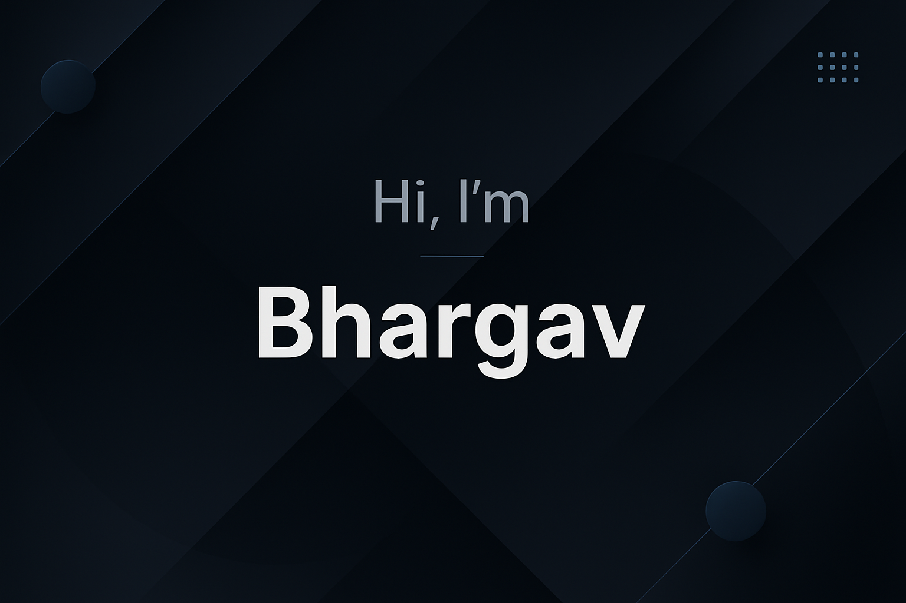

<h1 align="center">Hi 👋, I'm Bhargav Bhalodiya</h1>

  

  <b>Cloud & DevOps Enthusiast | Python Developer | AWS Certified | Self-Learner</b>

---

## 🧠 About Me

- 🔭 I’m currently working on **AWS Cloud Projects**
- 🌱 I’m learning **Terraform, Kubernetes, CI/CD & Monitoring**
- 💬 Ask me about **AWS, Linux, Networking, DevOps & automation**
- 📫 Connect with me:  
  🌐 [Portfolio](https://bhargavbhalodiya04.github.io/Portfolio/)  
  💼 [LinkedIn](https://www.linkedin.com/in/bhargavbhalodiya/)

---

## 🚀 Skills

<!-- Cloud & OS -->

<!-- Containers & Orchestration -->

<!-- Infrastructure as Code & CI/CD -->

<!-- Monitoring -->

<!-- Version Control -->

<!-- Programming -->

---

## 🏅 Certifications

| Certificate | Issued By | Date |
|------------|----------|------|
| ✅ **AWS Academy Cloud Foundations** | AWS Academy | April 2025 |
| ✅ **Linux Essentials** | NDG & Cisco Networking Academy | Oct 2024 |
| ✅ **Data Visualization using Plotly** | Coursera Project Network | 2024 |
| ✅ **Python for Beginners – Data Structures** | Coursera Project Network | 2024 |
| ✅ **Python for Beginners – Variables & Strings** | Coursera Project Network | 2024 |
| ✅ **Network Defense** *(Module)* | Cisco Networking Academy | Dec 2024 |
| ✅ **Introduction to Cybersecurity** | Cisco Networking Academy | Dec 2024 |
| ✅ **Resource Specialist** *(Module)* | Cisco Networking Academy | Dec 2024 |
| ✅ **System Safeguards** *(Module)* | Cisco Networking Academy | Dec 2024 |
| ✅ **Threat Analysis** *(Module)* | Cisco Networking Academy | Nov 2024 |
| ✅ **Cybersecurity Administration** *(Module)* | Cisco Networking Academy | Nov 2024 |

---

## 📊 Monitoring Stack Experience

- 📈 **Grafana** – Dashboards & visualization  
- 🔍 **Prometheus** – Metrics collection  
- 🚨 **Alertmanager** – Alerting & notifications  

---

## 📫 Contact

- 🌐 **Portfolio:** https://bhargavbhalodiya04.github.io/Portfolio/
- 💼 **LinkedIn:** https://www.linkedin.com/in/bhargavbhalodiya/

---

⭐ *Always learning, building, and improving cloud-native systems*
