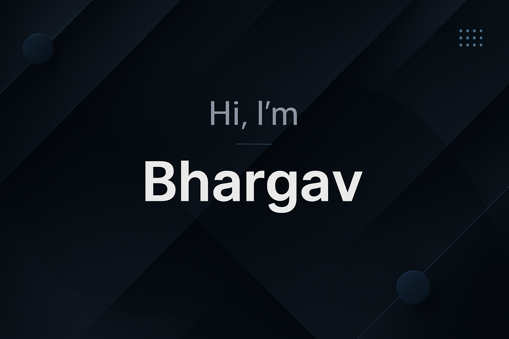

<h1 align="center">Hi 👋, I'm Bhargav Bhalodiya</h1>

  

  <b>🚀 Cloud & DevOps Enthusiast | 🐍 Python Developer | ☁️ AWS Certified</b>

  

---

## 🧠 About Me

- 🔭 Currently working on **AWS Cloud Projects**
- 🌱 Learning **Terraform | Kubernetes | CI/CD | Monitoring**
- 💬 Ask me about **AWS, Linux, Networking, DevOps & Automation**
- 📫 Contact: **+91 8490839630**

🌐 [Portfolio](https://bhargavbhalodiya04.github.io/Portfolio/)  
💼 [LinkedIn](https://www.linkedin.com/in/bhargavbhalodiya/)

---

## 🚀 Tech Stack

  

---

## 🏅 Certifications

| Certificate | Issed By | Date |
|------------|----------|------|
| ✅ Decoding DevOps – From Basics to Advanced Projects with AI | Udemy | Jan 2026 |
| ✅ AWS Academy Cloud Foundations | AWS Academy | Apr 2025 |
| ✅ Linux Essentials | NDG & Cisco | Oct 2024 |
| ✅ Data Visualization using Plotly | Coursera | 2024 |
| ✅ Python (Data Structures, Strings, Variables) | Coursera | 2024 |
| ✅ Cybersecurity Modules | Cisco Networking Academy | 2024 |

---

## 📊 GitHub Stats

  
  

---

## 💻 Most Used Languages

  

---

## 🏆 Trophies

  

---

## 📊 DevOps Focus

- ☁️ AWS Cloud Architecture  
- ⚙️ CI/CD Pipelines (GitHub Actions, Jenkins)  
- 🐳 Containerization (Docker, Kubernetes)  
- 📈 Monitoring (Prometheus, Grafana, Alertmanager)  

---

## 📫 Contact

- 🌐 Portfolio: https://bhargavbhalodiya04.github.io/Portfolio/
- 💼 LinkedIn: https://www.linkedin.com/in/bhargavbhalodiya/

---

⭐ Always learning, building, and improving cloud-native systems
